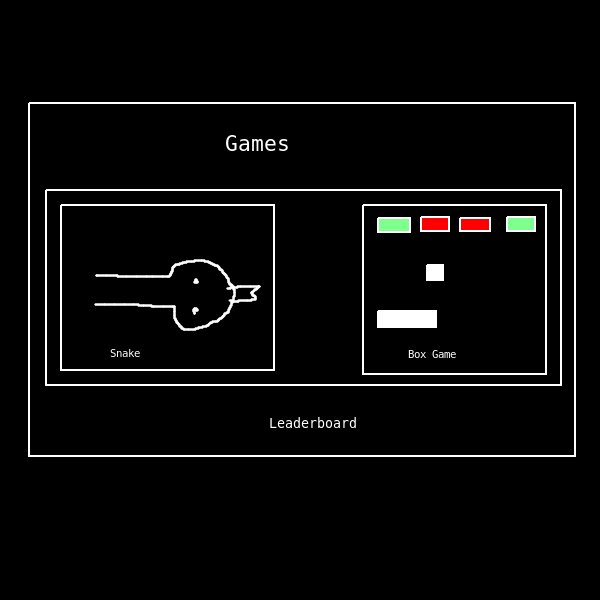
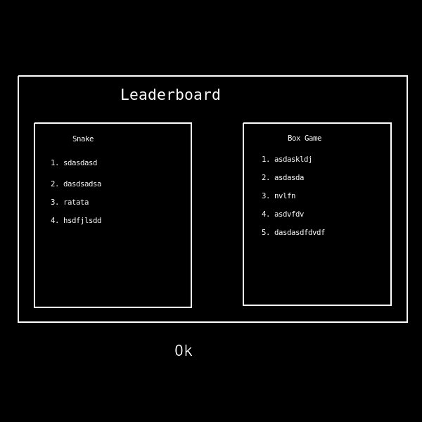
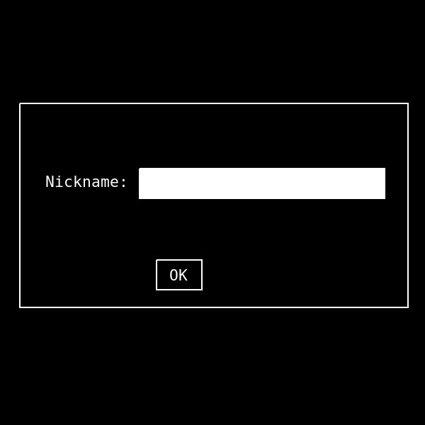
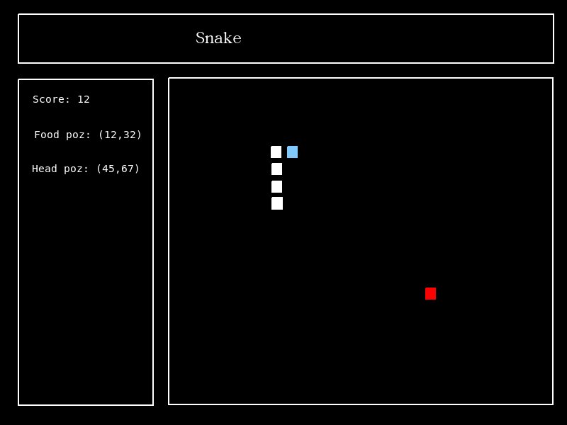
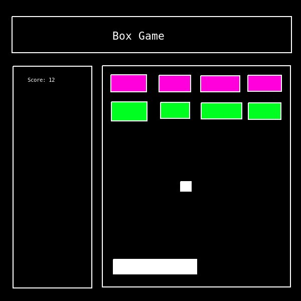

# Project requirements

- ## Main menu
    - Access leaderboard
    - Enter nickname
    - Select game to play

    

- ## Leaderboard
    - See top scorers from each game
    - Data read out from sqlite3 database, created when game opened first.

    

- ## Nickname
    - Player can enter nickname
    - While in the session, after each game over, player score gets saved in the database

    

- ## Games
    - ### Snake
        - Traditional snake game
        - Player gets score after food eaten
        - If the snake's head collides with its body, game ends

        

    - ### Box
        - Traditional game
        - Player control the ball with the platform
        - Goal: Destroy all platforms
        - If player misses ball, games ends
        - Score is added after each hit
        - Some platforms need to be hit multiple times

        

# Price

45000 EUR